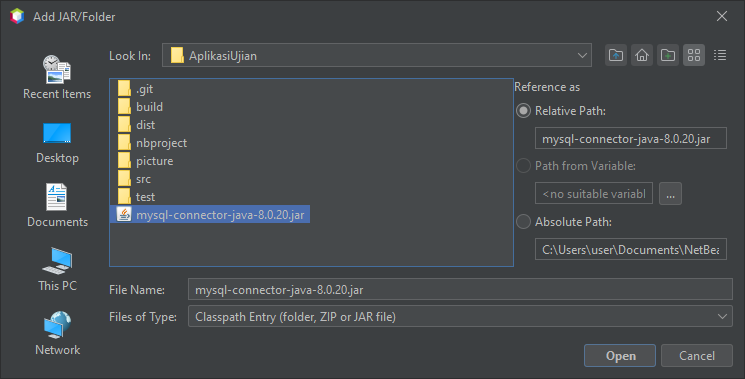
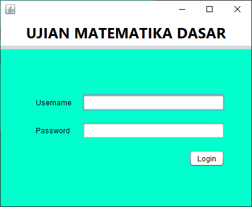

# APLIKASI UJIAN MATEMATIKA SEDERHANA 📝
Aplikasi ujian sederhana sebagai bentuk pemenuhan tugas mata kuliah Pemrograman Berbasis Objek 2. Dengan fitur yang mencakup:
-   **Ujian 4 kategori**
-   **Timer pengerjaan ujian**
-   **Progress tracker**
-   **Tabel nilai**

Ujian matematika menjadi tidak ribet dan lebih menyenangkan (mungkin).

----

## 🔧 Setup
### 1. Import database `simple_math_exam.sql` di mySQL

---

### 2. Add JAR/File di netbeans dan pilih `mysql-connector-java-8.0.20.jar`

---

### 3. Jalankan aplikasi melalui `Run Project`

---

### 4. Pada login bukalah aplikasi menggunakan user sesuai role dibawah
#### Guru
-   Username = `Conan` dan password = `guru123`
-   Username = `Mitsuhiko` dan password = `guru123`
#### Siswa
-   Username `Ayumi` dan password = `siswa123`
-   Username `Genta` dan password = `siswa123`

---